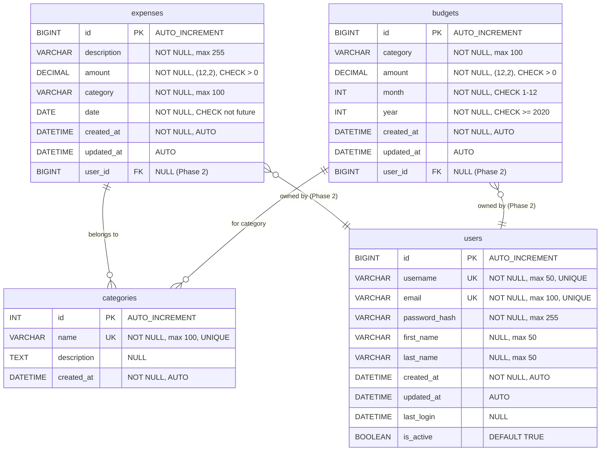
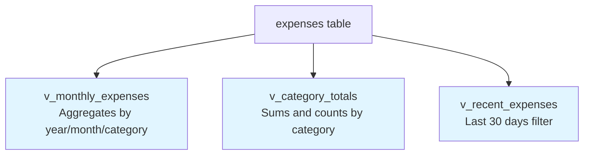
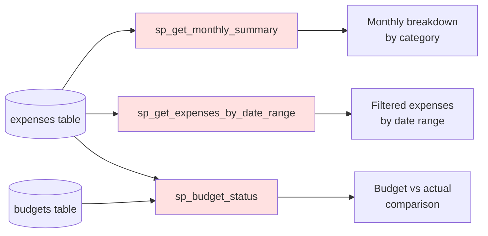
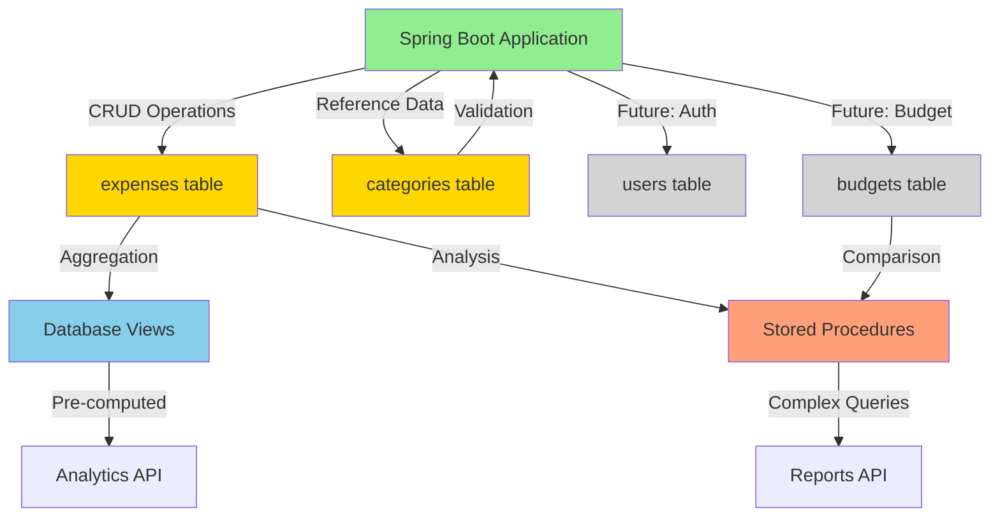
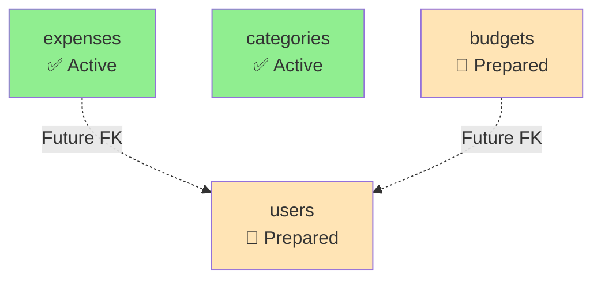
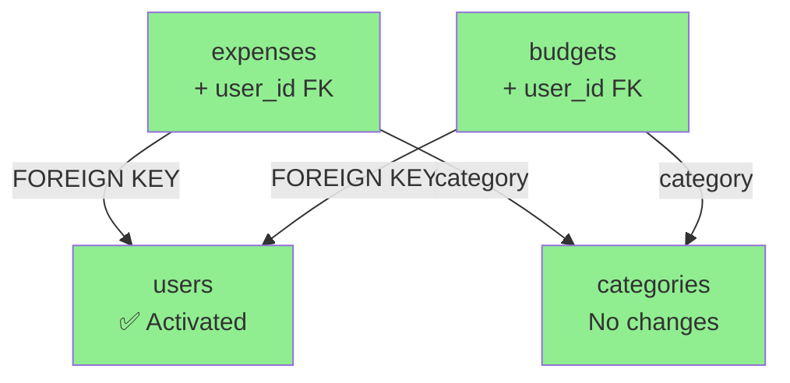
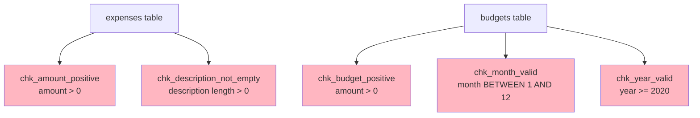
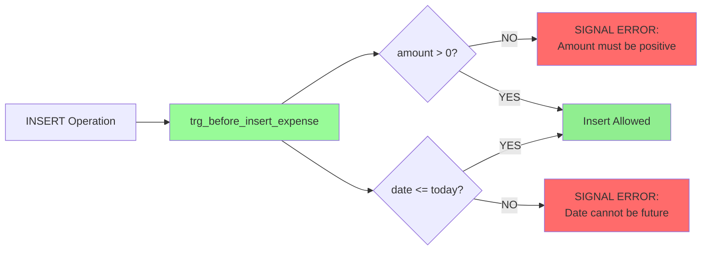
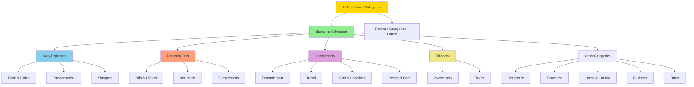
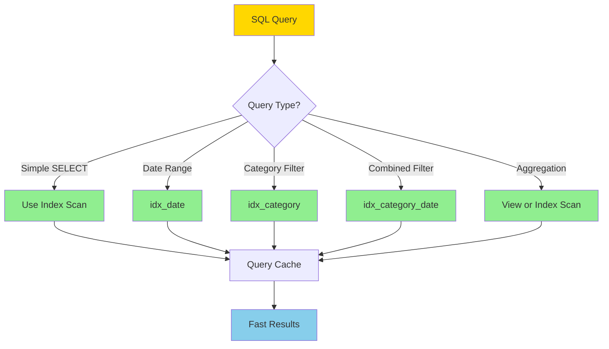

# Database Schema UML Diagram
## Smart Expense Tracker - Entity Relationship Diagram

**Database Engineer:** Michael Basye  
**UMGC CMSC 495 Capstone Project - Group 3**

---

## Entity Relationship Diagram

---

## Database Views

---

## Stored Procedures

---

## Index Structure

### expenses Table Indexes

| Index Name | Columns | Type | Purpose |
|------------|---------|------|---------|
| PRIMARY | id | Clustered | Primary key access |
| idx_category | category | Non-clustered | Category filtering |
| idx_date | date | Non-clustered | Date range queries |
| idx_created_at | created_at | Non-clustered | Audit queries |
| idx_updated_at | updated_at | Non-clustered | Recent changes |
| idx_category_date | category, date | Composite | Combined filters |
| idx_amount | amount | Non-clustered | Amount-based queries |
| idx_description | description(100) | Partial | Text search |

### Categories Table Indexes

| Index Name | Columns | Type | Purpose |
|------------|---------|------|---------|
| PRIMARY | id | Clustered | Primary key access |
| UNIQUE | name | Unique | Enforce unique names |

### Users Table Indexes

| Index Name | Columns | Type | Purpose |
|------------|---------|------|---------|
| PRIMARY | id | Clustered | Primary key access |
| UNIQUE | username | Unique | Login lookup |
| UNIQUE | email | Unique | Email uniqueness |
| idx_username | username | Non-clustered | Fast username lookup |
| idx_email | email | Non-clustered | Fast email lookup |

### Budgets Table Indexes

| Index Name | Columns | Type | Purpose |
|------------|---------|------|---------|
| PRIMARY | id | Clustered | Primary key access |
| UNIQUE | category, month, year | Composite Unique | No duplicate budgets |
| idx_month_year | month, year | Composite | Period queries |

---

## Data Flow Diagram

---

## Schema Evolution (Phase 2)

### Current State (Phase 1)

### Future State (Phase 2)

---

## Constraints and Triggers

### Check Constraints

### Triggers

---

## Category Hierarchy

---

## Query Performance Flow

---

## Summary Statistics

| Component | Count | Status |
|-----------|-------|--------|
| **Tables** | 4 | ✅ Complete |
| **Indexes** | 17 total | ✅ Optimized |
| **Views** | 3 | ✅ Active |
| **Stored Procedures** | 3 | ✅ Active |
| **Triggers** | 1 | ✅ Active |
| **Check Constraints** | 7 | ✅ Enforced |
| **Foreign Keys** | 0 (2 prepared) | 📝 Phase 2 |
| **Categories** | 16 | ✅ Seeded |

---

**Diagram Created By:** Michael Basye - Database Engineer  
**Date:** November 3, 2025  
**Schema Version:** 1.0

---

## How to View These Diagrams

### On GitHub
These Mermaid diagrams render automatically when viewing this file on GitHub.

### Locally
1. **VS Code:** Install "Markdown Preview Mermaid Support" extension
2. **IntelliJ IDEA:** Mermaid plugin available
3. **Online:** Copy diagram code to https://mermaid.live/

### Export Options
- **PNG/SVG:** Use mermaid.live to export images
- **PDF:** Print GitHub page to PDF
- **Documentation:** Embed in project documentation
